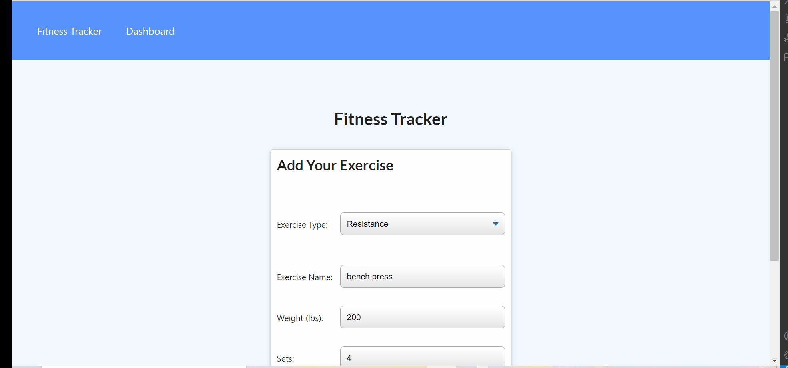

# Workout-Tracker

## Table of Contents
- [Description](#Description)
- [Installation](#Installation)
- [Usage](#Usage)
- [Contributing](#Contribution)
- [Tests](#Tests)
- [License](#License)
- [Contact](#Contact)
- [Link to Repository](#Repository)
- [Link to Deployed page](#Deployed)
    
## Description
A Nosql application that allows users to create and track daily workouts. 
The application answers to the following user story and acceptance criteria:

### User Story

```md
As a user, I want to be able to view create and track daily workouts. I want to be able to log multiple exercises in a workout on a given day. I should also be able to track the name, type, weight, sets, reps, and duration of exercise. If the exercise is a cardio exercise, I should be able to track my distance traveled.
```

### Acceptance Criteria

```md
When the user loads the page, they should be given the option to create a new workout or continue with their last workout.

The user should be able to:

  * Add exercises to the most recent workout plan.

  * Add new exercises to a new workout plan.

  * View the combined weight of multiple exercises from the past seven workouts on the `stats` page.

  * View the total duration of each workout from the past seven workouts on the `stats` page.
```

        
## Installation & Usage

Demo 



        
## Contribution
Mohamed Bassiouni
        
## Tests
NA.
        
## License
This project is licensed under the terms of the following license: 
    
[](https://opensource.org/licenses/MIT)
    
        
## Contact
GitHub: [MohamedB-01](https://github.com/MohamedB-01). 
    
For inquiries, please contact m.m.bassiouni@gmail.com.
    
## Link to Repository 
https://github.com/MohamedB-01/Workout-Tracker
    
## Link to Deployed page
https://mohamedb-workout-tracker.herokuapp.com/exercise?id=61187dea7def4f0016d7d540